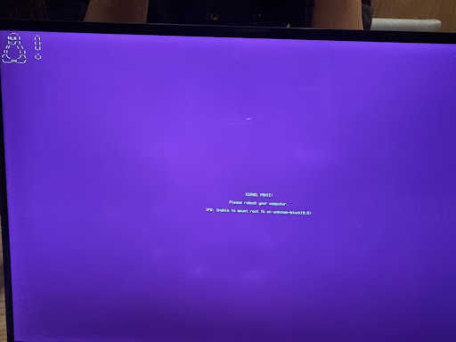

# Ubuntu Kernel Panic Recovery & Hardening Log (Dell XPS 13 9310)

## 1. 発生した問題 (Symptoms)

### Phase 1: 起動時の KERNEL PANIC
- **症状:** `KERNEL PANIC! Attempted to kill init! exitcode=0x00000007`

### Phase 2: 描画異常とシステムハング
- **症状:** マウスカーソル矩形化および極度の低速化

### Phase 3: 起動イメージ破損
- **症状:** `VFS: Unable to mount root fs on unknown-block(0,0)`

## 2. 解決手順と学び
1. 旧カーネルでの起動。
2. GRUB設定の永続化。
3. `update-initramfs` によるイメージ修復。
