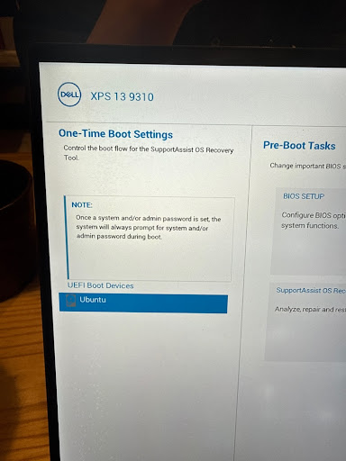
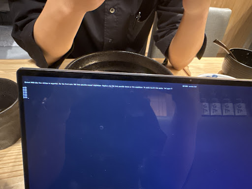
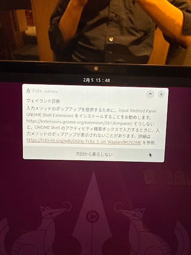

# Ubuntu Kernel Panic Recovery & Hardening Log (Dell XPS 13 9310)

## 1. 発生した問題 / Symptoms

### Phase 1: 起動時の KERNEL PANIC / Boot-time Kernel Panic
- **症状 / Symptom:** `KERNEL PANIC! Attempted to kill init! exitcode=0x00000007`
- **Description:** カーネルアップデート直後の起動不能状態。 / System failed to boot immediately after a kernel update.

### Phase 2: 描画異常とシステムハング / Graphical Glitches and System Hang
- **症状 / Symptom:** マウスカーソル矩形化および極度の低速化。Wayland環境でのドライバ不整合が疑われる。 / Mouse cursor turned into a square block with extreme system lag. Suspected driver incompatibility in the Wayland environment.

### Phase 3: 起動イメージ破損 / Boot Image Corruption
- **症状 / Symptom:** 強制終了により `initramfs` が破損し、`VFS: Unable to mount root fs` が発生。 / Forced shutdown caused `initramfs` corruption, leading to `VFS: Unable to mount root fs` error.

---

## 2. 復旧プロセス / Recovery Process

トラブルシューティング中に使用した特殊なブート環境の記録です。 / Documentation of the specific boot environments used during troubleshooting.

| Dell XPS 13 9310 Boot Menu | GRUB Rescue Shell |
| :---: | :---: |
|  |  |

---

## 3. 解決手順 / Final Solutions

1. **安定カーネルの選択 / Select Stable Kernel:**
   - **JP:** GRUBの `Advanced options` から旧バージョン（-27）で起動。
   - **EN:** Booted from the previous stable version (-27) via GRUB's `Advanced options`.
2. **ブート設定の永続化 / Persistent Boot Configuration:**
   - **JP:** `/etc/default/grub` を編集し、`GRUB_DEFAULT=saved` を適用。
   - **EN:** Edited `/etc/default/grub` and applied `GRUB_DEFAULT=saved` to lock the stable kernel.
3. **イメージの再生成 / Regenerate Boot Images:**
   - **JP:** `sudo update-initramfs -u -k all` で全カーネルの起動ファイルを修復。
   - **EN:** Repaired boot files for all kernels using `sudo update-initramfs -u -k all`.

---

## 4. 復旧後の確認 / Post-Recovery Verification

日本語入力環境（Fcitx5）のWayland最適化診断を確認し、正常動作を担保。 / Verified system stability by running the Wayland optimization diagnostic for the Japanese input environment (Fcitx5).

